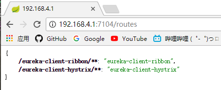
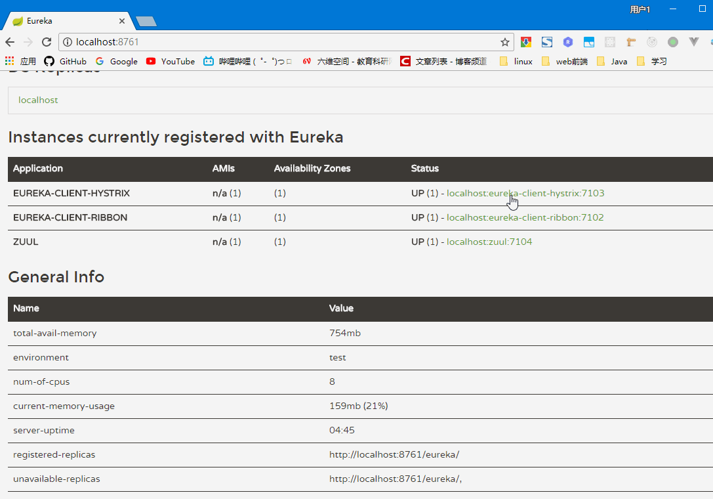

# Spring Cloud Netflix
## Zuul
1 代理Eureka上所有的服务ZuulProxy
--
### 依赖
```xml
<dependency>
	<groupId>org.springframework.cloud</groupId>
	<artifactId>spring-cloud-starter-eureka</artifactId>
</dependency>
<dependency>
	<groupId>org.springframework.cloud</groupId>
	<artifactId>spring-cloud-starter-zuul</artifactId>
</dependency>
```
### 配置
普通的Eureka客户端配置
```
server.port=7104
spring.application.name=zuul

eureka.instance.prefer-ip-address=true
eureka.client.service-url.defaultZone=http://localhost:8761/eureka/
```
外加一条header的过滤配置
```
zuul.sensitiveHeaders= Cookie,Set-Cookie
```
默认很多header参数都会被过滤，如Authorization，Cookie等，单独设置（像上面这样）则只会过滤设置的这两条。
### 注入方式
直接在启动类添加注解
```java
@EnableZuulProxy
```
### 效果
通过Zuul的url可以访问其他所有服务的url，代理方式：
```
http://zuulip:zuulport/service-name/xxx  代理  http://service-name:serviceport/xx
```
如果配置了actuator，能通过/routes查看路由映射信息如下

