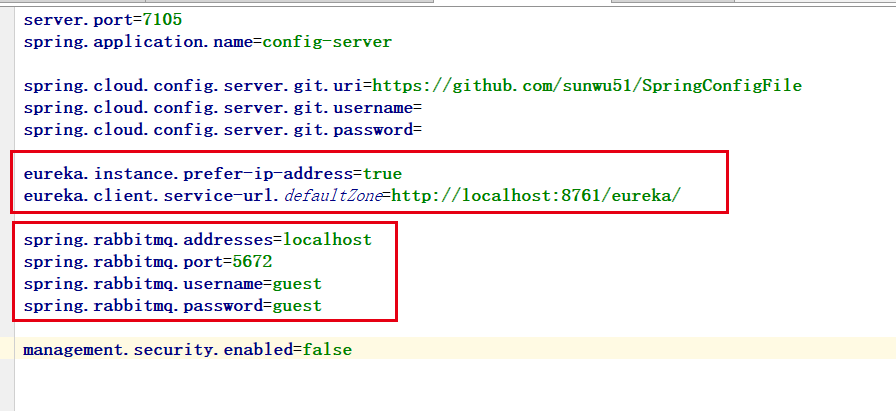
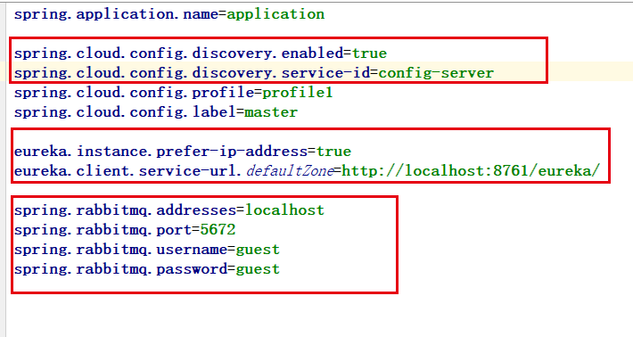

# Spring Cloud Config
## 说明
这个项目添加了bus和eureka的功能，添加了两者的依赖，并安装了RabbitMQ，进行了相关配置如下  
**Config Server**  

**Config Client**  

## 效果
Eureka使得我们不用在Client的配置文件中配死Server的地址。    
Bus使配置文件更新后，只需要POST触发Config-Server的`/bus/refresh`就可以引起所有Client的refresh。  
**实际使用中服务器在公网可以配置github的webhook功能，更新配置后自动触发这个刷新接口**。这里我用工具模拟了webhook的请求，因为我自己的pc上没有公网地址

