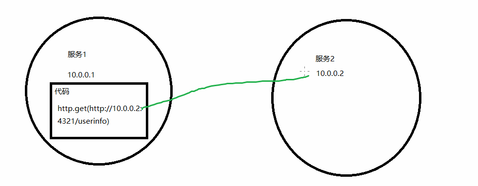
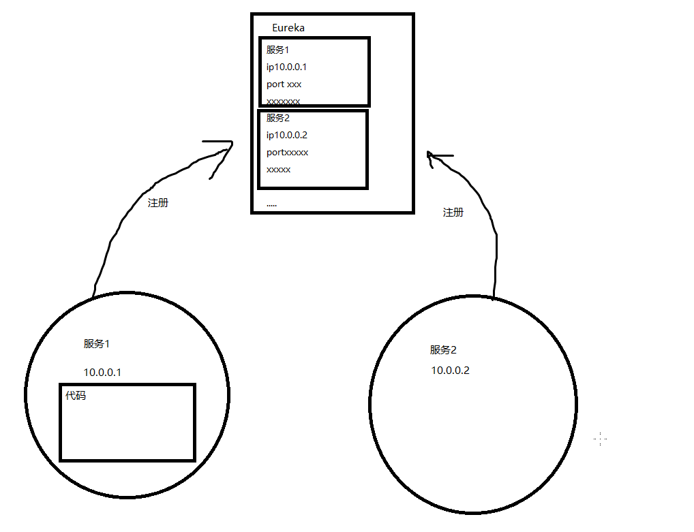
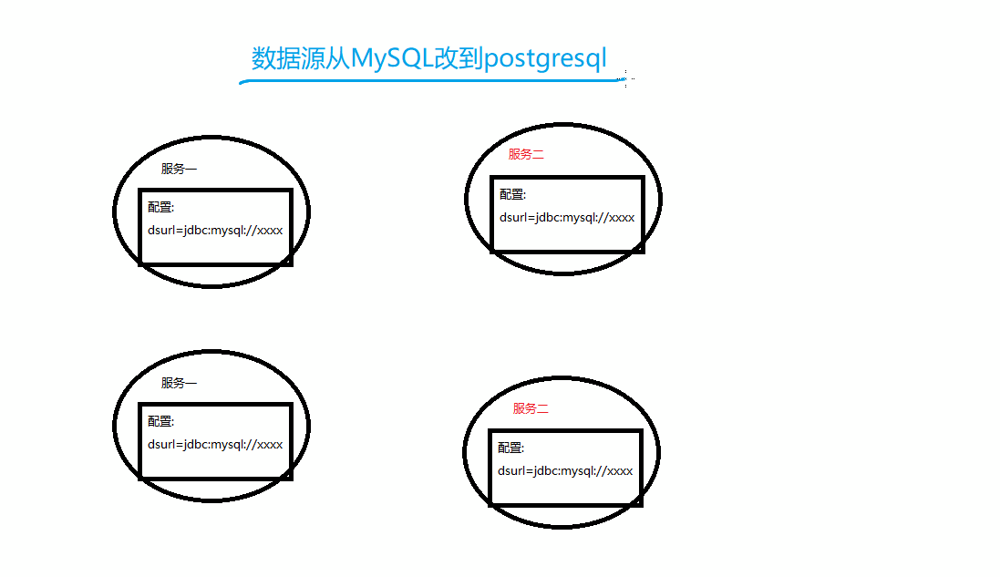
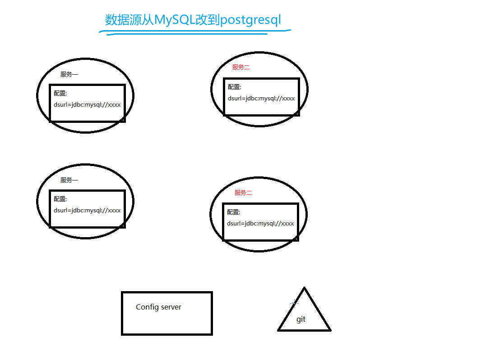

# Spring Cloud Samples
SpringCloud是Spring为微服务构架专门做的一个项目，这个大的项目下有多个子项目，分别是为了解决一定的问题，一起来看下。

1 Netflix子项目
--
## Eureka
第一个问题： 微服务中有数据访问的两个服务之间，需要配置彼此的Ip+Port，而一但任意一个服务的Ip或Port发生了变化，则需要修改另一个服务的配置，并重新运行。  

解决思路： 如果能服务能够**自发现**动态的配置就好了。 Eureka就是解决服务的自发现问题，运行原理是有一个独立运行的Eureka服务器，所有微服务都是以客户端的身份先注册进来。在有相互依赖的微服务中，通过指定应用名就可以找到注册为这个应用名的微服务服务器。  

第二个问题： 服务可以注册在Eureka了，有的服务如服务二有多个机器在运行，服务一请求服务二的时候需要进行**负载均衡**，怎么实现。  

解决思路： Eureka中默认就有Ribbon可以进行负载均衡，在不使用Eureka的时候也可以单独使用Ribbon完成负载均衡。
## Hystrix
第三个问题： 任何一个微服务的宕机，都会导致依赖这个微服务的服务不可用，越底层的微服务宕机，会更危险。
解决思路： 有些时候没法解决只能通过多加几个微服务保证高可用，但是也可以设置当所有的实例都不可用的时候，返回一个默认给定的值，让系统继续工作。这就是Hysrix。
## Zuul
第四个问题： 微服务将一个庞大的服务拆分成了多个，如果一个业务中，客户需要分别请求3个微服务的url才能完成。因为每个微服务可能是运行在不同的机器甚至是容器中的这个url也会发生变化，一个服务有多个实例运行的时候，负载均衡的重任转到了前端，前端：WTF?。需要有个网关统一代理下面的微服务url。

解决方法： 可以借鉴Nginx反向代理的思路，将所有的服务都挂在一个对外地址下，不过如果直接用Nginx需要配置很多规则。Zuul则可以直接作为Eureka的客户端就能自动代理所有的微服务。

>>netflix小结  
Netflix是原本是一家光碟租赁商的名称，在cloud中也担任了这样一个中间商人的角色。Eureka提供了服务注册和自发现的功能当然不限于Eureka还有ZooKeeper等其他实现的项目；Ribbon实现了同一服务多个实例间的负载均衡；Hystrix则可以以默认值返回的方式，避免雪崩效应；Zuul则提供了统一的网关入口；

2 Config子项目
## SpringCloud Config
第五个问题： 每个服务都有自己的配置，但是微服务之间有着紧密的联系，一个服务的配置如果要变化，可能需要牵连其他服务也变化，当然同一个服务的每个实例都要变化。如何能统一管理所有微服务的配置 以及 如何动态的改变微服务的配置 是两个重要的话题。

解决思路： 将配置统一放到一个服务上进行维护，通过版本控制器如git来维系配置文件，当仓库push后触发config server更新配置文件，下发到各个服务中。这就是SpringCloud Config的功能。

