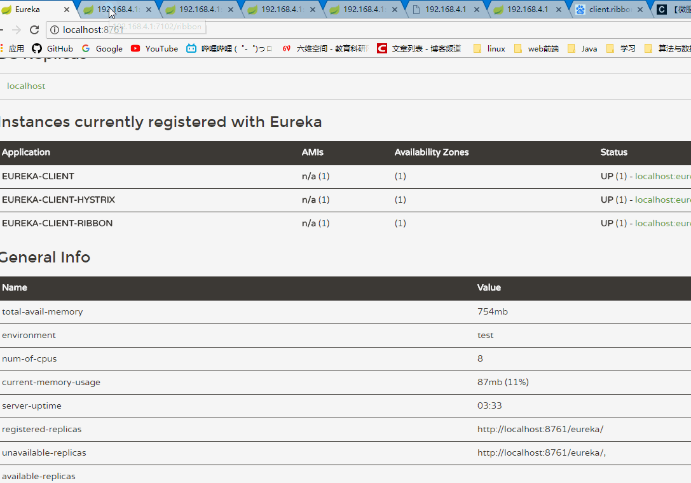

# Spring Cloud Netflix
## Eureka Client With Ribbon and Hystrix
在eureka-client-ribbon的基础上进行的修改
## 添加依赖
```xml
<dependency>
	<groupId>org.springframework.cloud</groupId>
	<artifactId>spring-cloud-starter-hystrix</artifactId>
</dependency>
```
## 注入方式
在启动类上添加注解
```
@EnableHystrix
```
对请求其他服务的方法进行改装
```java
@HystrixCommand(fallbackMethod = "fallback")
public String test(){
    String str = restTemplate.getForObject("http://eureka-client/",String.class);
    return "data from http://eureka-client/ is <<< "+str+" >>>";
}
private String fallback(){
    return "default value from hystrix";
}
```
当`eureka-client`的服务请求失败的时候，就会返回fallback的返回值

