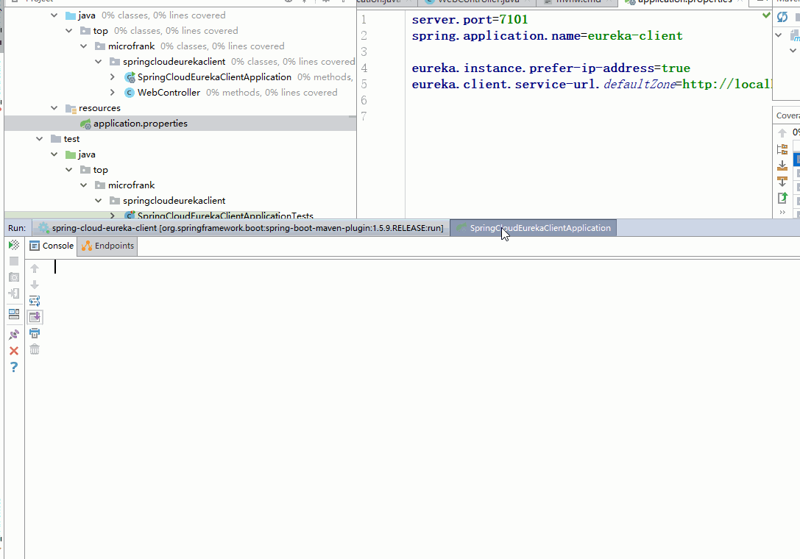

# Spring Cloud Netflix
## Eureka Client With Ribbon
Ribbon可以实现负载均衡
## 添加依赖
如果添加了Eureka依赖则不需要单独添加Ribbon的依赖了
## 注入方式
将eureka-client项目直接复制过来，添加一个Bean
```java
@Bean
@LoadBalanced
public RestTemplate restTemplate(){
	return new RestTemplate();
}
```
这个Bean对restTemplate进行了增强，使其在请求url的时候会先到EuServer上查看有没有这个应用名，如果有则负载均衡的获取一个实例。

## retry
有一个实际的问题是微服务虽然已经down掉，但是还没有从EuServer上注销，此时如果负载均衡请求就会有失败的时候

此时可以使用Spring-Retry来设置服务超时可以换其他实例
```
spring.cloud.loadbalancer.retry.enabled=true

eureka-client.ribbon.ConnectTimeout=250
eureka-client.ribbon.ReadTimeout=1000
eureka-client.ribbon.OkToRetryOnAllOperations=true
eureka-client.ribbon.MaxAutoRetriesNextServer=2
eureka-client.ribbon.MaxAutoRetries=1

```
例如上述设置了eureka-client这个服务的请求：超时时间是1s+0.25s，所有操作都允许retry。  
如果请求失败，则还向这个服务器发送1次重试。  
如果还是失败则，向一个新的实例服务器发送请求。   
这个新服务器如果还是失败则，再向这个新服务器发送2次。  
仍旧失败则再选一个新服务器重复上一步的过程。   
最终全部服务器失败才算失败`Connection refused`。